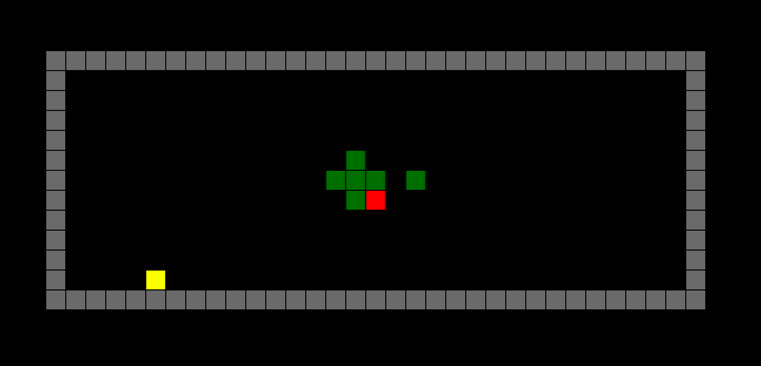

Multi-agent RL environment, in the style of DeepMind's [Gathering game](https://deepmind.com/blog/understanding-agent-cooperation/).

---

`python demo.py` plays a trained RL agent against a random agent. The RL agent can be re-trained in a couple minutes with `python reinforce.py`.

The map is customizable. All but the "Open map" from DeepMind's [paper](https://arxiv.org/pdf/1707.06600.pdf) are available in the `maps` directory. To use e.g. the "Basic single-entrance region map" from the paper, pass `map_name='region_single_entrance'` to the `GatheringEnv` constructor. To specify your own map, create a text file in the same format as the existing maps, and pass `map_name='path/to/my/custom/map'` to the `GatheringEnv` constructor.